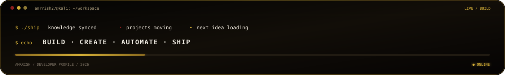

<div align="center">



<br />

<code>full-stack</code>&nbsp;&nbsp;·&nbsp;&nbsp;<code>AI builder</code>&nbsp;&nbsp;·&nbsp;&nbsp;<code>security research</code>&nbsp;&nbsp;·&nbsp;&nbsp;<code>CTF player</code>

</div>

---

## `~/about`

```text
Amrrish Roshan — building AI-powered web systems and exploring web security,
APIs, CTFs, Linux, backend engineering and automation.
```

## `~/security`

<div align="center">

`WEB SECURITY`　 `API SECURITY`　 `NETWORK SECURITY`　 `KALI / LINUX`

`CTF`　 `OSINT`　 `VULNERABILITY RESEARCH`　 `SECURITY AUTOMATION`

</div>

```text
RECON      nmap · gobuster · ffuf · subfinder
ANALYSIS   Wireshark · binwalk · ExifTool · strings · xxd
WEB        Burp Suite · OWASP ZAP · Fiddler
```

## `~/selected-projects`

| project | focus |
|:--|:--|
| [FounderFlow](https://github.com/amrrish27/FounderFlow) | Startup-exit classification with FastAPI and a Random Forest model |
| [Ratefluencer](https://github.com/amrrish27/viral-mode) | AI-assisted trend intelligence and content workflow |
| [Sellora AI](https://github.com/amrrish27/sales-nova-ai) | AI sales-assistant product with Supabase and Gemini |
| [ZeroDayHeist writeups](https://github.com/amrrish27/ZeroDayHeist_CTF_Writeups) | Forked community reference across forensics, RE, OSINT, and crypto |

## `~/stack`

<p align="center">
  
</p>

## `~/ctf-log`

```text
╭─ ZERO DAY HEIST 2026 / GRAND FINALE
│ TEAM     : Kn1ghts
│ RESULT   : #09
╰─ STATUS   : OBJECTIVE COMPLETE
```

<details>
<summary><code>github telemetry</code></summary>
<br />
<p align="center">
  
  
</p>
</details>

<p align="center">
  
</p>


