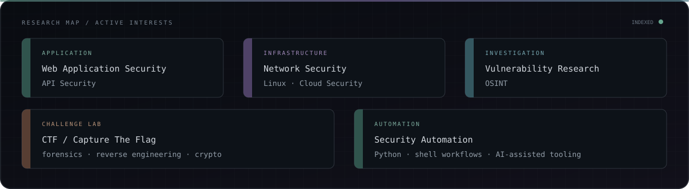

<div align="center">


<br />

<code>software engineer</code>&nbsp;&nbsp;·&nbsp;&nbsp;<code>AI builder</code>&nbsp;&nbsp;·&nbsp;&nbsp;<code>security enthusiast</code>&nbsp;&nbsp;·&nbsp;&nbsp;<code>CTF player</code>

</div>

<br />

## `~/profile`

```json
{
  "name": "Amrrish Roshan",
  "focus": ["full-stack systems", "AI applications", "security engineering"],
  "interests": ["web + API security", "CTFs", "backend systems", "automation"],
  "working_style": "build → inspect → break → debug → harden → ship"
}
```

<br />

## `~/security`



<br />

```text
RECON              nmap · gobuster · ffuf · subfinder
WEB                Burp Suite · OWASP ZAP · Fiddler
ANALYSIS           Wireshark · binwalk · ExifTool · strings · xxd
PASSWORD / CRYPTO  John the Ripper
ENVIRONMENT        Kali Linux · Bash · Git
LANGUAGES          Python · JavaScript · TypeScript · C · C++
```

<sub>Tools are grouped by workflow, not ranked by invented proficiency scores.</sub>

<br />

## `~/engineering`

| layer | working set |
|:--|:--|
| `interface` | React · Next.js · Vite · Tailwind CSS |
| `services` | Node.js · Express.js · Python · FastAPI |
| `data` | MongoDB · MySQL · Firebase · Supabase |
| `delivery` | Git · GitHub · Docker · AWS |
| `intelligence` | AI agents · LLM applications · automation |

<p align="center">
  
</p>

<br />

## `~/projects`

| project | system | verified stack | state |
|:--|:--|:--|:--|
| [FounderFlow](https://github.com/amrrish27/FounderFlow) | Startup-exit classification dashboard with model probabilities and feature importance | FastAPI · Python · scikit-learn · HTML/CSS/JS | `production demo` |
| [Ratefluencer](https://github.com/amrrish27/viral-mode) | AI-assisted trend analysis, content generation, and pre-publish scoring | React · TypeScript · Vite · Tailwind · Gemini | `prototype` |
| [Sellora AI](https://github.com/amrrish27/sales-nova-ai) | AI sales assistant with lead workflows, conversation tooling, and analytics | React · TypeScript · Vite · Supabase · Gemini | `active development` |
| [AUREX](https://github.com/amrrish27/Aura-Health) | Experimental wellness MVP for personalized health-risk and prevention insights | React · TypeScript · Vite · Tailwind · Supabase | `MVP` |
| [FlowSync](https://github.com/amrrish27/Flowsync) | Gamified student productivity and task-management platform | Next.js · React · TypeScript | `internship build` |
| [AttendAI](https://github.com/amrrish27/AttendAI) | Student/faculty attendance workflows with analytics and QR-based flows | Next.js · React · TypeScript | `internship build` |
| [Quizzy](https://github.com/amrrish27/Quizzy) | Interactive category-based quiz experience with scoring and authentication support | Next.js · React · TypeScript · Firebase | `internship build` |
| [ZeroDayHeist writeups](https://github.com/amrrish27/ZeroDayHeist_CTF_Writeups) | Reference set spanning forensics, reverse engineering, OSINT, steganography, and crypto | ExifTool · binwalk · xxd · Ghidra · Volatility | `forked reference` |

<br />

## `~/ctf`

```text
┌─ INCIDENT RECORD / 2026
│
├─ EVENT      ZERO DAY HEIST — GRAND FINALE
├─ SQUAD      Team Kn1ghts
├─ RESULT     #09
└─ STATE      CLOSED / OBJECTIVE COMPLETE

   research trail → forensics · reverse engineering · OSINT · steganography · crypto
```

> Supporting material: [`ZeroDayHeist_CTF_Writeups`](https://github.com/amrrish27/ZeroDayHeist_CTF_Writeups) is retained as a forked community writeup reference; authorship is not claimed here.

<br />

## `~/current-operations`

| channel | signal |
|:--|:--|
| `[BUILDING]` | AI-powered applications · full-stack systems · backend APIs |
| `[RESEARCH]` | web security · API security · CTF workflows |
| `[LEARNING]` | AI agents · cloud · Docker · system design |

<br />

## `~/telemetry`

<div align="center">
  
  
</div>

<div align="center">
  
</div>

<details>
<summary><code>expand contribution trace</code></summary>
<br />
<p align="center">
  
</p>
</details>

<br />


