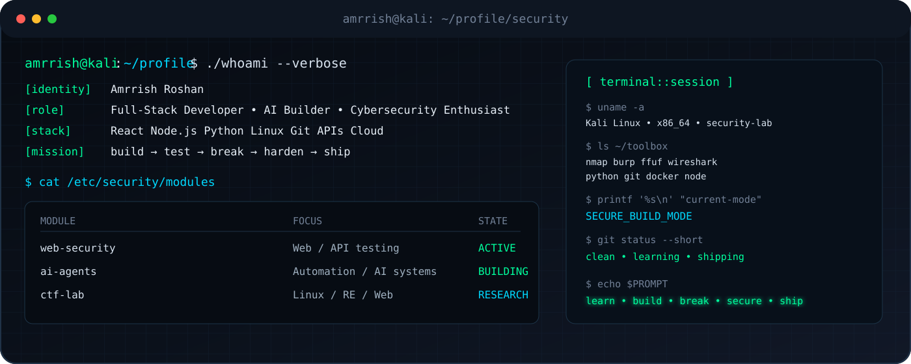

<div align="center">

# AMRRISH ROSHAN

### `FULL-STACK • AI • CYBERSECURITY`

**Computer Science Student · CTF Player · AI Builder · Security-Focused Developer**

[](https://github.com/amrrish27)
[](https://github.com/amrrish27)

</div>

<p align="center">
  
</p>

---

## `~/about`

```text
┌──[ amrrish@kali ]──[ ~/about ]
└─$ ./profile --summary

  identity   : Amrrish Roshan
  role       : Full-Stack Developer / AI Builder
  domain     : Web Security / CTF / Automation
  environment: Linux / Git / Docker / Cloud
  approach   : build → test → break → harden → ship

  interests
  ├── offensive & defensive security
  ├── web / API security
  ├── AI agents & intelligent automation
  ├── backend engineering
  └── real-world product development

└─$ echo "security is a feature, not an afterthought"
```

---

## `~/security-lab`

> **Cybersecurity is a core engineering track — not just a visual theme.**

| Area | Focus |
|---|---|
| 🌐 Web Security | Authentication, authorization, input handling, OWASP-style testing |
| 🔌 API Security | API behavior, access control, request/response analysis |
| 🐧 Linux | Kali Linux, shell workflows, permissions, tooling |
| 🧪 CTF Research | Web, forensics, reverse engineering and challenge writeups |
| 🤖 Security Automation | Python scripting, automation and AI-assisted workflows |
| ☁️ Cloud Security | Secure application deployment and cloud fundamentals |

### `~/toolbox`

<p align="center">


</p>

---

## `~/projects`

### 🔐 [ZeroDayHeist CTF Writeups](https://github.com/amrrish27/ZeroDayHeist_CTF_Writeups)
Security challenge writeups covering investigation, exploitation concepts, tooling and solution methodology.

### 🤖 [Sales Nova AI](https://github.com/amrrish27/sales-nova-ai)
AI-powered application focused on sales workflows and productivity.

### 🧠 [Quizzy](https://github.com/amrrish27/Quizzy)
Interactive quiz application with scoring and learning-focused user flows.

### 🎓 [AttendAI](https://github.com/amrrish27/AttendAI)
Attendance management application designed around streamlined tracking and record management.

### 🏥 [Aura Health](https://github.com/amrrish27/Aura-Health)
Wellness-focused application built around a practical user experience.

### 📋 FlowSync
Workflow and productivity platform focused on organizing tasks and tracking progress.

---

## `~/achievements`

```text
[+] ZERO DAY HEIST 2026 CTF GRAND FINALE
    └── Team Kn1ghts · 9th Place

[+] CODESOFT APP DEVELOPMENT INTERNSHIP
    └── Completed · built and deployed multiple applications

[+] SECURITY / CTF
    └── Active participation in cybersecurity challenges
```

---

## `~/engineering-stack`

```text
LANGUAGES       JavaScript · TypeScript · Python · C · C++
FRONTEND        React · Vite · Tailwind CSS
BACKEND         Node.js · Express.js · REST APIs
DATABASES       MongoDB · MySQL · PostgreSQL
DEVOPS          Git · GitHub · Docker · Linux
AI              AI Agents · Automation · LLM Applications
SECURITY        Web Security · API Security · CTF · Linux Security
CLOUD           AWS / Cloud Fundamentals
```

---

## `~/github-telemetry`

<div align="center">


</div>

<div align="center">


</div>

---

## `~/contributions`

<p align="center">
  
</p>

---

## `~/current-operation`

```bash
#!/usr/bin/env bash

MISSION="BUILD_SECURE_SYSTEMS"

while true; do
    learn
    build
    test
    break
    debug
    harden
    ship
 done
```

<div align="center">

### `BUILD • BREAK • DEBUG • SECURE • SHIP`

`[ connection established ]` · `[ attack surface understood ]` · `[ systems secured ]`

</div>

---

<div align="center">

**Open to building, collaborating, competing and learning.**

</div>
