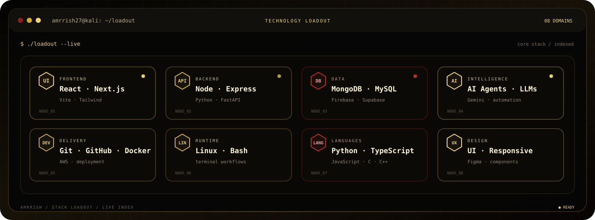

## `01 / DEVELOPER WORKSTATION`

  

 

  

## `02 / SELECTED WORK`

> **01 — FOUNDERFLOW** · `FastAPI` · `Python` · `scikit-learn`  
> Startup-exit classification and ML decision support.  
> [Open repository →](https://github.com/amrrish27/FounderFlow)

> **02 — RATEFLUENCER** · `React` · `TypeScript` · `AI`  
> Creator trend intelligence, content workflows and scoring.  
> [Open repository →](https://github.com/amrrish27/viral-mode)

> **03 — SELLORA AI** · `React` · `Supabase` · `Gemini`  
> AI sales workflows for leads, conversations and analytics.  
> [Open repository →](https://github.com/amrrish27/sales-nova-ai)

 

## `03 / TECHNOLOGY LOADOUT`

 

## `04 / CURRENT MODE`

  

