## `01 / DEVELOPER WORKSTATION`

 

 

## `02 / SELECTED WORK`

 

## `03 / TECHNOLOGY LOADOUT`

 

## `04 / CURRENT MODE`

`BUILD` &nbsp;·&nbsp; `CREATE` &nbsp;·&nbsp; `AUTOMATE` &nbsp;·&nbsp; `SHIP`

  

